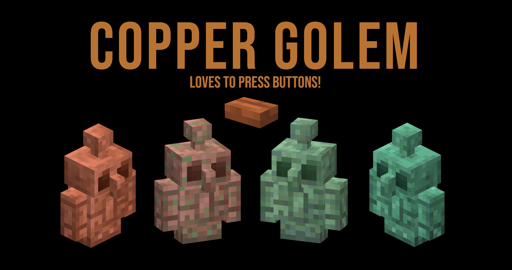

# Copper Golem for Fabric 🤖
Sadly at __Minecraft Live 2021__ the Copper Golem did not win the vote to get added into 1.18.

But this little golem is so cute I did not want to see it get missed in Minecraft!

> Functionality is experimental and is based on what Mojang announced at Minecraft Live 2021.

### Requires at least Fabric API 0.41.0

## To run the mod
### Single player
You can run this mod on a single player world by just having it in your mods folder.

### Multiplayer
The server must have the mod installed.

Clients need to have the mod installed to see the golems. If they do not have the mod the game seems to render a Pig for me 🤷‍♂️.

---

## Features
### Copper Buttons
* Waxed and unwaxed variants
  * Lower redstone signal and breaking strengths when oxidised

### Spawning
* The spawning combo is a bottom __Copper Block__, middle __Carved Pumpkin__ Block and top __Lightning Rod__.
* In creative, you can use the Copper Golem spawn egg

### Goals, in priority order
* Swim, to escape from water
* Escape from danger, run away from attackers
* Wandering around, this is taken straight from the Iron Golem code, to wander near villagers or to random blocks
* Press button
* Looking around
* Spin head
* Rod wiggle
* Look at player
* Look at Iron Golems, as they're their big brother

* Find buttons to press

### Oxidation
* Random ticks will cause oxidation to increment, of which are 4 levels (0-3)
* Interacting with the mob with Honeycomb to Wax it
* Interacting with the mob with an any Axe will unwax it, if waxed, otherwise if not at first oxidation level will deoxidise it by 1 level
* Lightning strikes will set oxidation level to 0 (min level) if not waxed

## Animations
* Spinning head randomly
* Arm/body moving when pressing button
* Rod wiggling randomly
* Body wiggle when walking

## Current to do list
### Entity
* Oxidation is done via random ticks from copper blocks, but once whey are waxed or reach oxidized state no more random ticks occur. 
* Freezing limbs in place once at last stage of oxidation
* Lightning attracted to golem
* Walking / running speed should decrease with oxidation level

### Mod / Cloth menu
* Option to select all/specific buttons to press. Currently, any button extending from `AbstractButtonBlock` will be targeted.

... more to be added

### Special thanks to Carloski for the Copper Golem textures! ❤️
